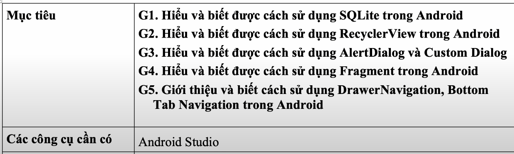

### Android

A. assignment 1

B. assignment 2


### Flutter

<details>
<summary style="margin-bottom: 10px;"><strong>Flutter Native Splash</strong></summary>

Để thêm màn hình splash vào ứng dụng Flutter của bạn, hãy làm theo các bước sau:

1. **Thêm gói `flutter_native_splash` vào tệp `pubspec.yaml`:**

   ```yaml
   dependencies:
     flutter_native_splash: ^2.x.x # Thay thế ^2.x.x bằng phiên bản mới nhất
   ```

2. **Chạy lệnh để cài đặt gói:**

   ```bash
   flutter pub get
   ```

3. **Tạo tệp cấu hình `flutter_native_splash.yaml` trong thư mục gốc của dự án:**

   ```yaml
   flutter_native_splash:
     color: "#F4D58D" # Màu nền cho màn hình splash
     color_dark: "#001427" # Màu nền cho chế độ tối

     android_12:
       color: "#BF0603" # Màu nền cho Android 12

     web: false # Tắt màn hình splash cho web
   ```

   _Lưu ý:_ Android 12 yêu cầu cấu hình riêng do có cách xử lý màn hình splash khác biệt.

4. **Chạy lệnh để tạo màn hình splash:**

   ```bash
   flutter pub run flutter_native_splash:create --path=flutter_native_splash.yaml
   ```

   _Lưu ý:_ Mỗi khi bạn thay đổi nội dung trong `flutter_native_splash.yaml`, hãy chạy lại lệnh này để cập nhật màn hình splash.

5. **Chạy ứng dụng:**

   ```bash
   flutter run
   ```

   _Lưu ý:_ Đọc log trong terminal để kiểm tra nếu có lỗi hoặc thông tin cần thiết.

6. **Tham khảo thêm:**

   - [Trang chủ của `flutter_native_splash` trên pub.dev](https://pub.dev/packages/flutter_native_splash)

</details>

<details>
<summary style="margin-bottom: 10px;"><strong>Flutter Navigation </strong></summary>
   - dùng navigator push và pop vào stack
   - chuyển màn mà kèm data thì đều dùng MaterialPageRoute
      + 1 là thông qua constructor
      + 2 là settings: RouteSettings( arguments: ,  ),
      + 3 là có trò dùng route như trên web, '/' ,'/screen2',...
</details>
